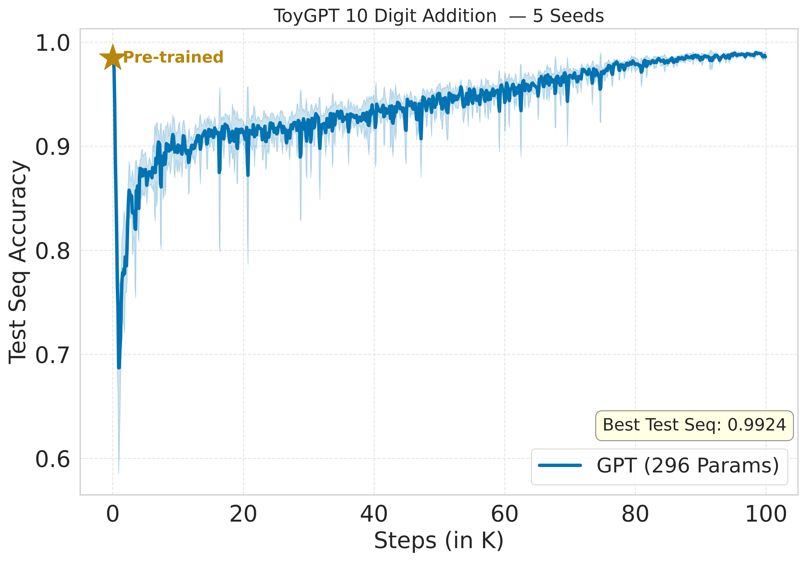

# Curriculum Pretraining Enables 10-Digit Addition in a 296-Parameter GPT

A 296-parameter GPT model trained to perform digit-wise addition of two 10-digit numbers. The training follows a two-stage recipe: curriculum-style pre-training on variable-length addition (2–10 digits), followed by fine-tuning on fixed 10-digit addition with Latest Weight Averaging (LAWA).

---

## Results

Despite having only 296 parameters, the GPT model reliably learns 10-digit addition end-to-end (Figure 1). A curriculum (ish)-based pretraining stage followed by LAWA fine-tuning is sufficient for a sub-300-parameter GPT to solve the task.

<p align="left">
  
  <br>
  <em><strong>Figure 1.</strong> Test accuracy (10-digit sequence) vs. training steps for a standard 296-parameter GPT model. Without altering the architecture, we modify only the training recipe: the model is pretrained using a curriculum from 2-digit to 10-digit addition and subsequently fine-tuned on the 10-digit task, achieving 99% accuracy. </em>
</p>

## Model Architecture

`AdditionGPT` is a minimal causal transformer that treats digit-wise addition as a sequence classification task.

**Input format:** Each addition example is a sequence of length `T = seq_len + 1 = 11`. At each position `t`, the model receives a pair `(a_t, b_t)` of input digits (0–9), normalized as `x / 9 - 0.5`. The final position carries the output carry digit.

**Architecture:**

```
Input (B, T, 2)
   → Linear input projection  (2 → d)
   → + Positional Embedding   (T × d)
   → Transformer Block × L:
        LayerNorm → CausalSelfAttention → residual
        LayerNorm → MLP (GELU, 4× expand) → residual
   → Final LayerNorm
   → Output head (d → 10)     [digit logits, cross-entropy loss]
```

**Config (default):** `d = n_embd = 4`, `n_head = 2`, `n_layer = 1`, `block_size = 11`, `bias = False`, `dropout = 0.0`

**Parameter breakdown (296 total):**

| Component          | Shape        | Params |
|--------------------|--------------|--------|
| Input projection   | 2 × 4        | 8      |
| Positional embedding | 11 × 4     | 44     |
| LN₁ (weight)       | 4            | 4      |
| Attention QKV      | 4 × 12       | 48     |
| Attention out proj | 4 × 4        | 16     |
| LN₂ (weight)       | 4            | 4      |
| MLP fc             | 4 × 16       | 64     |
| MLP proj           | 16 × 4       | 64     |
| Final LN (weight)  | 4            | 4      |
| Output head        | 4 × 10       | 40     |
| **Total**          |              | **296**|

---

## Training Recipe

### Stage 1 — Pre-training (`toyGPT_pretrain.py`)

Pre-training uses variable-length addition examples (2 to 10 digits), which acts as a form of curriculum learning — the model first learns short, easy additions before encountering the full 10-digit task.

- **Dataset:** 10k train / 10k test samples; sequence length sampled uniformly from `[2, 10]`; sequences padded to `max_len + 1 = 11` with a binary mask applied to the loss
- **Objective:** masked cross-entropy loss (only valid digit positions contribute)
- **Optimizer:** AdamW, `max_lr = 8e-3`, `min_lr = 8e-4`
- **Schedule:** 1000-step linear warmup → cosine decay over 100k steps
- **Gradient clipping:** norm = 1.0
- **Checkpoint:** best model by test sequence accuracy → `ckpt/toygpt_pt.pt`

### Stage 2 — Fine-tuning (`toyGPT_addition.py`)

Fine-tuning specialises the pre-trained model on fixed 10-digit addition, using **LAWA (Latest Weight Averaging)** to stabilise training.

- **Dataset:** 10k train / 10k test samples of exactly 10-digit addition
- **Optimizer:** AdamW, same LR schedule as pre-training (100k steps)
- **LAWA:** every 2000 steps a weight snapshot is pushed onto a rolling buffer of size `k = 5`; the averaged model is evaluated alongside the live model
- **Multi-seed:** runs with seeds `{0, 1, 42, 222, 1337}`; logs saved to `logs/toygpt_lawa_seed=<seed>.txt`
- **Checkpoint:** best model by test sequence accuracy → `ckpt/toygpt_ft_seed=<seed>.pt`

---

## Usage

```bash
# Stage 1: pretrain on variable-length addition (curriculum)
python toyGPT_pretrain.py

# Stage 2: fine-tune on 10-digit addition (run per seed)
python toyGPT_addition.py --seed 0
python toyGPT_addition.py --seed 42
Or run all seeds in one go:

# run all at once
bash run.sh
```


## Contribution Statement

Sunny Sanyal conceived the idea of curriculum-based pretraining combined with LAWA (Latest Weight Averaging) during fine-tuning, and ran all experiments himself. Claude wrote all code. 
Its suggested solutions were primarily architectural modifications, while the final approach focused on training-recipe changes rather than altering the model architecture.

## Citation

```bibtex
@misc{toyGPT_curriculum_pre-training_2026,
  author       = {Sunny Sanyal},
  title        = {Curriculum Pretraining Enables 10-Digit Addition in a 296-Parameter GPT},
  year         = {2026},
  note         = {Blog},
}
